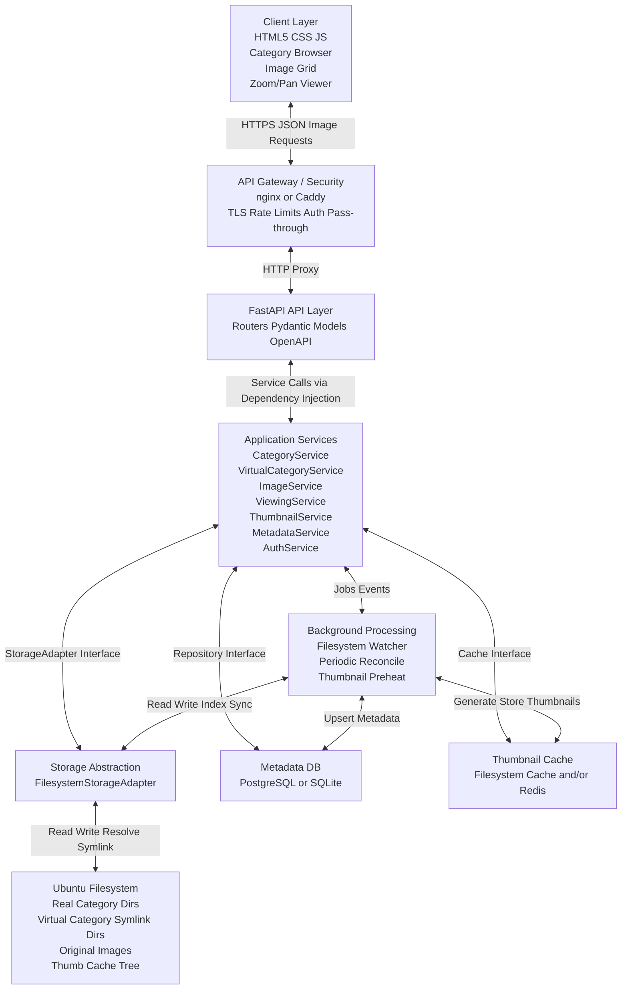

# dynamo
Dynamo is a modular python-native FastAPI photo-sharing app that uses POSIX folders as categories and symlinks as virtual collections, enabling portable, flexible organization and gradual feature development without duplicating images.  Images are dynamically accessed via a browser and the backend's FastAPI. The backend is deployed as a Docker container

The design goal is to keep the system modular, loosely coupled, and suitable for incremental implementation.

All of dynamo was created by AIs and based on my initial requirements document and a high-level architectural document.

## System Goals

- Provide a browsable hierarchy of categories and subcategories backed by directories on disk.
- Allow directories to contain both real image files and symbolic links to images.
- Support virtual categories that behave like normal categories but are composed of symlinked images from any location in the library.
- Serve thumbnails, medium-size display images, and full-resolution images.
- Provide a browser image viewer with zoom and pan support.
- Use open standards and open source tools: FastAPI, HTML5, CSS, JavaScript, nginx or Caddy, Pillow or ImageMagick, PostgreSQL or SQLite.
- Keep interfaces explicit so components can be replaced or extended later.
- Support both lazy discovery and background synchronization of metadata and thumbnails as files are added directly to the filesystem.

## Architectural Style

The system uses a layered, ports-and-adapters style architecture.

- The frontend depends only on HTTP APIs.
- The API layer depends only on application services.
- Application services depend on interfaces, not concrete implementations.
- Filesystem access is isolated behind a storage adapter.
- Metadata persistence is isolated behind a repository interface.
- Thumbnail creation is isolated behind a thumbnail service and cache abstraction.
- Background workers use the same services as the API layer, either through internal service wiring or admin endpoints.

This structure allows the filesystem implementation to be replaced with cloud object storage later without rewriting business logic.

## High-Level Block Diagram

## Runtime Components

1. **Client Layer:**
  The client layer is a browser-based user interface built with HTML5, CSS, and JavaScript.
  
2. **API Gateway / Security Layer:**
  This layer is typically implemented with nginx or Caddy in front of FastAPI.
  
3. **FastAPI API Layer:**
  The API layer is the HTTP boundary for the system. All API services in this architecture are handled by FastAPI.
  
4. **Application Services Layer:**
  This layer contains business logic and is the core of the application.
  
5. **Storage Abstraction Layer:**
  This layer isolates all interaction with the Ubuntu filesystem.
  
6. **Persistence Layer:**
  A small relational database is strongly recommended even though the filesystem is the source of truth for image existence.
  
7. **Thumbnail and Metadata Update Strategy:**
  The system must support files being added directly to the filesystem outside any front-end application. For that reason, synchronization must not rely on upload events alone.
  

These are documented in an initial, and lengthier, archtiecture document. A copy of it can be reviewed in the doc folder
